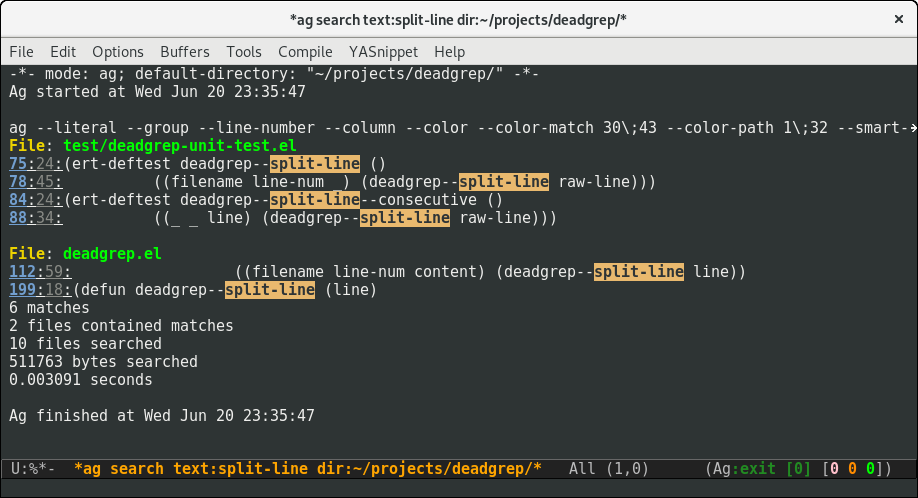

## counsel

[Counsel](https://github.com/abo-abo/swiper) provides the command
`counsel-rg` (and similar commands `counsel-ag` and `counsel-ack`).

These provide as-you-type search results. This is a different style of
working to deadgrep.el, and it's a great complementary tool.

## ag.el

[ag.el](https://github.com/Wilfred/ag.el/) allows you to use `ag` for
Emacs searches. I wrote it, but I've learnt a lot about good search
UIs since I built ag.el.

`ag` is not quite as fast as `rg`, so results come more slowly.

ag.el has a lot of search commands to memorise:

* `ag`
* `ag-project`
* `ag-project-files`
* `ag-files`
* `ag-regexp`
* `ag-project-regexp`

This only covers some of the possible filter combinations, and caused
confusion for users who expected regexp search to be the default.

Results buffers here are much busier, showing superfluous
information. This is because ag.el is built on top of
`compilation-start`, which isn't a great fit for searching.

## rg.el

https://github.com/dajva/rg.el

## ripgrep.el

https://github.com/nlamirault/ripgrep.el

## socyl

https://github.com/nlamirault/socyl
