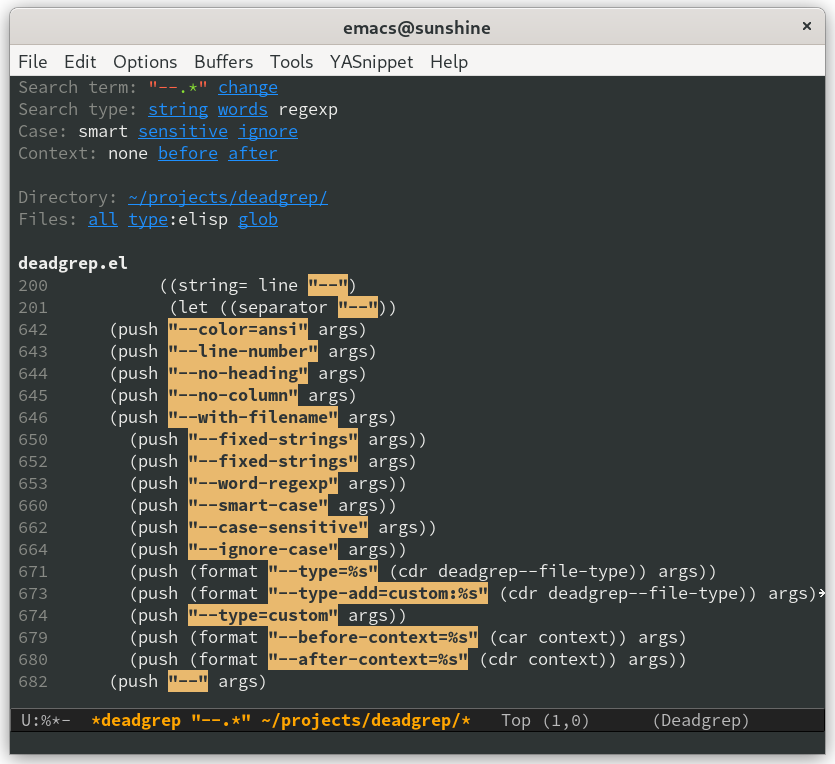
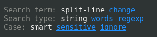
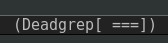
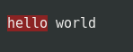
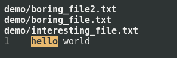
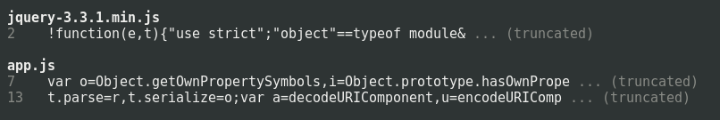

# Deadgrep: use ripgrep from Emacs ☠️

Deadgrep is the fast, beautiful text search that your Emacs
deserves.

[](https://coveralls.io/github/Wilfred/deadgrep?branch=master) [](https://melpa.org/#/deadgrep)



<!-- markdown-toc start - Don't edit this section. Run M-x markdown-toc-generate-toc again -->
**Table of Contents**

- [Usage](#usage)
    - [Installation](#installation)
    - [Keybindings](#keybindings)
    - [Minibuffer](#minibuffer)
    - [Easy Debugging](#easy-debugging)
- [Features](#features)
    - [Super Fast](#super-fast)
    - [Context Aware](#context-aware)
    - [Easy Filtering](#easy-filtering)
    - [Polish](#polish)
- [Alternative Projects](#alternative-projects)

<!-- markdown-toc end -->

## Usage

### Installation

1. Install [ripgrep](https://github.com/BurntSushi/ripgrep). You need
   version 0.8 or later.

2. Install deadgrep from MELPA (do `M-x package-install`
<kbd>RET</kbd> `deadgrep` within Emacs 25.1 or later),
or copy it into your `~/.emacs.d`.

3. (Optional) add deadgrep to a convenient shortcut. I like F5.

``` emacs-lisp
(global-set-key (kbd "<f5>") #'deadgrep)
```

### Keybindings

Navigating results:

| Key                               | Action                                         |
| ---                               | ---                                            |
| <kbd>RET</kbd>                    | Visit the result, file or push button at point |
| <kbd>o</kbd>                      | Visit the result in another window             |
| <kbd>n</kbd> and <kbd>p</kbd>     | Move between search hits                       |
| <kbd>M-n</kbd> and <kbd>M-p</kbd> | Move between file headers                      |

The commands `deadgrep-forward` and `deadgrep-backward` are also
available to move between buttons as well as search hits.

Starting/stopping a search:

| Key                           | Action                                                                  |
| ---                           | ---                                                                     |
| <kbd>S</kbd>                  | Change the search term                                                  |
| <kbd>T</kbd>                  | Cycle through available search types: string, words, regexp             |
| <kbd>C</kbd>                  | Cycle through case sensitivity types: smart, sensitive, ignore          |
| <kbd>F</kbd>                  | Cycle through file modes: all, type, glob                               |
| <kbd>I</kbd>                  | Switch to incremental search, re-running on every keystroke             |
| <kbd>D</kbd>                  | Change the search directory                                             |
| <kbd>^</kbd>                  | Re-run the search in the parent directory                               |
| <kbd>g</kbd>                  | Re-run the search                                                       |
| <kbd>TAB</kbd>                | Expand/collapse results for a file                                      |
| <kbd>C-c</kbd> <kbd>C-k</kbd> | Stop a running search                                                   |
| <kbd>C-u</kbd>                | A prefix argument prevents search commands from starting automatically. |

### Additional interactive commands

| Name                        | Action                                                         |
| ---                         | ---                                                            |
| `imenu`                     | Move between files in a results buffer.                        |
| `deadgrep-kill-all-buffers` | Kill all open deadgrep buffers.                                |
| `deadgrep-debug`            | In a results buffer, view the `rg` command, output and environment used. |

### Minibuffer

You use the minibuffer to enter a new search term.

You can also reuse a previous search term with <kbd>M-p</kbd> in the
minibuffer. To edit the default search term, use <kbd>M-n</kbd>.

### Easy Debugging

The easiest way to debug search results is to review the actual `rg` command executed.

Fortunately, the `deadgrep-debug` function makes it easy:

- Move to the deadgrep results buffer.
- Type `M-x deadgrep-debug`.
- Strike `enter`, and the debug buffer will appear.
- Move to the deadgrep debug buffer.

Study the results to review the `rg` command string and other debugging information to assist you.

## Features

### Super Fast

Deadgrep uses ripgrep for extremely fast text searches.

If you change your search settings, deadgrep will immediately re-run
your search.

### Context Aware

Deadgrep works hard to minimise your keystrokes.

**Search term**: If the region is active, deadgrep uses that.

**Search directory**: If your current file is in a VCS repository,
deadgrep uses that for your search directory.

**Regexp and case sensitivity options**: Deadgrep re-uses whatever
settings you used in your last search.

**Globbing and file types**: Deadgrep suggests file types and globbing
options that match the file you started the search from.

**Host**: If you're editing a remote file with Tramp, deadgrep will
search the remote machine. This requires `rg` to be installed on that
machine.

### Easy Filtering

Didn't get the results you wanted? It's easy to change the search
term, search type, or search directory, directly from the results
buffer. Just push the relevant button.



### Polish

Deadgrep uses spinners to give you feedback on whether your search has
finished.



It highlights regexp syntax according to the syntax accepted by `rg`.


When navigating to a line that matched, the relevant part of the line
is temporarily highlighted.



You can collapse and expand files with `TAB`.



Deadgrep handles minified files robustly.



You can always jump to exactly the position that point is on, even
when searching files that contain tab characters. You can also
navigate to the file itself from the file headings.

## Beta Features

You can now edit files directly from results buffers with `M-x
deadgrep-edit-mode`.

It is currently in beta, so you may also want to try [this pull
request on wgrep](https://github.com/mhayashi1120/Emacs-wgrep/pull/58).

## Alternative Projects

I believe that deadgrep is the best tool for doing Emacs text
searches, but there are some other great tools out there. See
[ALTERNATIVES](docs/ALTERNATIVES.md) for a discussion.

## Why the name?

The name "deadgrep" is a pun on "R.I.P. grep", and ripgrep.el was
already taken.

R.I.P wasn't actually the intention of the name "ripgrep" (see [their
FAQ](https://github.com/BurntSushi/ripgrep/blob/master/FAQ.md#what-does-the-rip-in-ripgrep-mean)),
but deadgrep is easy to remember and type.
