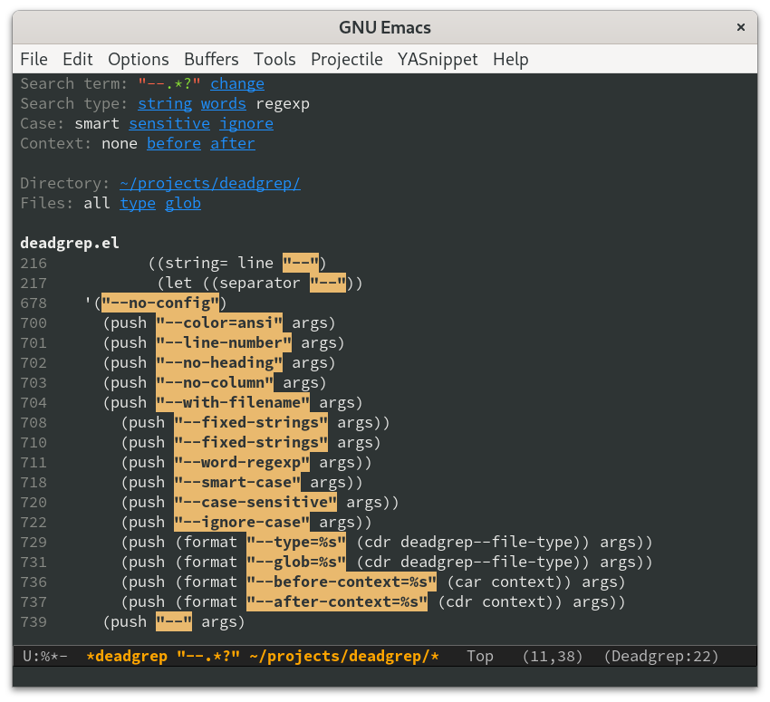

# deadgrep: use ripgrep from Emacs [](https://travis-ci.org/Wilfred/deadgrep) [](https://coveralls.io/github/Wilfred/deadgrep?branch=master) [](http://www.melpa.org/#/deadgrep)

Deadgrep is the fast, beautiful text search that your Emacs
deserves.



## Installation

1. Install [ripgrep](https://github.com/BurntSushi/ripgrep).

2. Install deadgrep from MELPA or copy it into your `~/.emacs.d`.

3. (Optional) add deadgrep to a convenient shortcut. I like F5.

``` emacs-lisp
(global-set-key (kbd "<f5>") #'deadgrep)
```

## Super Fast

Deadgrep uses ripgrep for extremely fast text searches.

If you change your search settings, deadgrep will immediately re-run
your search.

## Context Aware

Deadgrep works hard to minimise your keystrokes. Try running `M-x
deadgrep` with a region highlighted!

Deadgrep uses the root of your current git project to search from. You
can of course override this.

If you prefer regexp searches, or prefer case-insensitive searches,
deadgrep remembers. When you start a new search, it re-uses the
regexp and case settings from the previous search.

## Easy Filtering

Didn't get the results you wanted? It's easy to change the search
term, search type, or search directory, directly from the results
buffer. Just push the relevant button.


## Polish

Deadgrep uses spinners to give you feedback on whether your search has
finished.


It highlights regexp syntax according to the syntax accepted by `rg`.


You can collapse and expand files with `TAB`.


Deadgrep handles minified files robustly.


You can always jump to exactly the position that point is on, even
when searching files that contain tab characters. You can also
navigate to the file itself from the file headings.

## Alternative Projects

I believe that deadgrep is the best tool for doing Emacs text
searches, but there are some other great tools out there. See
[ALTERNATIVES](docs/ALTERNATIVES.md) for a discussion.
