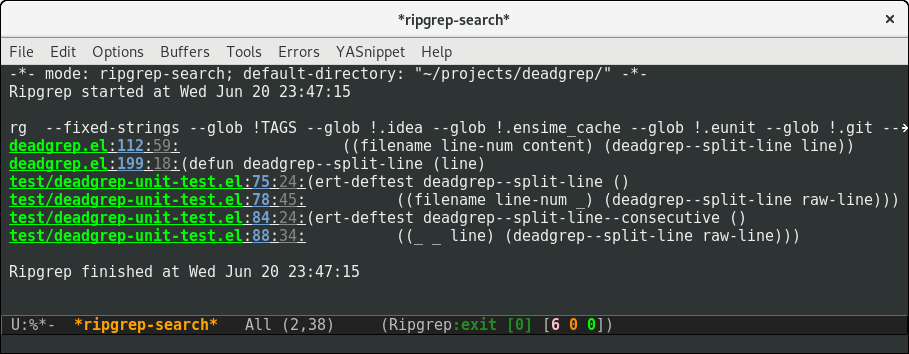
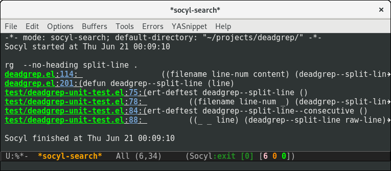
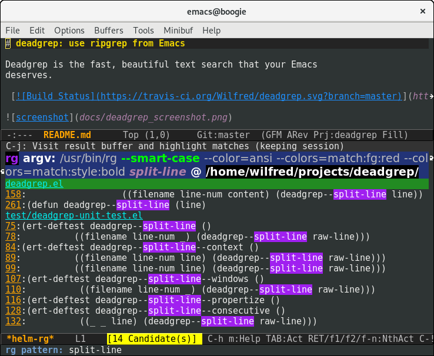

There are several great Emacs search tools available! I have learnt
lots when playing with these and reading their source code. You might
even find you end up using these as well as deadgrep, depending on
your workflow.

## counsel

[Counsel](https://github.com/abo-abo/swiper) provides the command
`counsel-rg` (and similar commands `counsel-ag` and `counsel-ack`).

This uses counsel's incremental searching UI.

**Great for**: As-you-type search results.

## ag.el

[ag.el](https://github.com/Wilfred/ag.el/) allows you to use `ag` for
Emacs searches. I wrote it, but I've learnt a lot about good search
UIs since I built ag.el.

`ag` is not quite as fast as `rg`, so results come more slowly.

ag.el has a lot of search commands to memorise:

* `ag`
* `ag-project`
* `ag-project-files`
* `ag-files`
* `ag-regexp`
* `ag-project-regexp`

This only covers some of the possible filter combinations, and caused
confusion for users who expected regexp search to be the default.

Results buffers here are much busier, showing superfluous
information. This is because ag.el is built on top of
`compilation-mode`, which isn't a great fit for searching.

ag.el has a few tests, but coverage is significantly lower than
deadgrep.

**Great for**: Searching with `ag`, binding a different search to
different keys, and editing files from the results buffer using
[wgrep](https://github.com/mhayashi1120/Emacs-wgrep).

## rg.el

[rg.el](https://github.com/dajva/rg.el) targets `rg`, and the results
buffer shows what type of search occurred.

It's built on `compilation-mode`, and you can use `rg-group-result` to
combine results.

**Great for**: if you want a ripgrep tool with excellent test
coverage, you have `compilation-mode` shortcuts, or if you do lots of
searches for words (`rg-dwim` is excellent).

## ripgrep.el

[ripgrep.el](https://github.com/nlamirault/ripgrep.el), and
projectile-ripgrep (part of the same project), is an alternative to
rg.el.

This is also using `compilation-mode` without grouping
results. 

**Great for**: ripgrep searches starting in the project root.

## socyl

[Socyl](https://github.com/nlamirault/socyl) is a generic text search
tool that supports `rg` plus others.

Socyl is also based on `compilation-mode`, and does not group results
by file AFAICS. As it's generic, users must specify a search backend,
as well as specifying the directory.

**Great for**: Using the same search UI with multiple different search
tools.

## helm-rg

[helm-rg](https://github.com/cosmicexplorer/helm-rg) targets Helm
users.

helm-rg is a [Helm](https://github.com/emacs-helm/helm) frontend for
`rg`. In addition to the usual search features, it treats spaces in
search terms specially so you don't need to worry about order. This
neat feature means that `foo bar` is equivalent to
`foo.*bar|bar.*foo`.

**Great for**: Using rg with Helm, especially with multiple search
terms.

## grep

`M-x grep` is a built-in Emacs command.

Users must specify the glob and the search term as part of a raw
`grep` command. This means your `.gitignore` is ignored, unlike `rg`,
`ag` or `ack`. This command also uses `compilation-mode`.

**Great for**: Doing a text search using only built-in tools.
